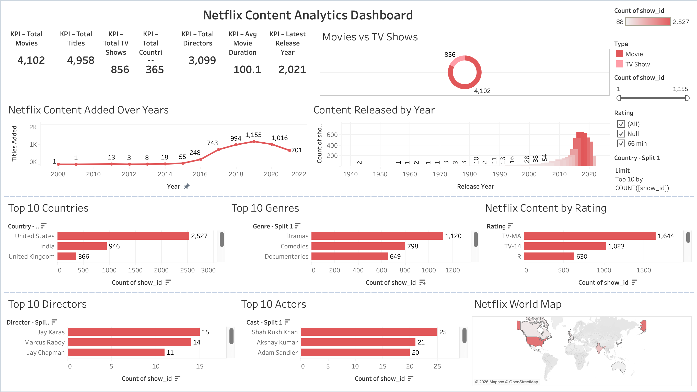

# 🎬 Netflix Content Analytics Dashboard

An interactive Tableau dashboard that provides insights into Netflix's Movies and TV Shows library. The dashboard analyzes content trends, genres, ratings, countries, directors, actors, and release years using interactive visualizations and KPIs.

---

## 📌 Project Overview

This project explores the Netflix Titles dataset to uncover meaningful insights about the platform's content library. The dashboard enables users to analyze content distribution, growth over time, geographical reach, ratings, and popular genres through an interactive and visually appealing interface.

---

## 🎯 Objectives

- Analyze Netflix's content library
- Compare Movies vs TV Shows
- Identify top contributing countries
- Discover popular genres
- Analyze content ratings
- Identify top directors and actors
- Visualize content growth over time
- Explore global content distribution

---

## 📊 Dashboard Features

### KPI Cards
- 🎬 Total Titles
- 🎥 Total Movies
- 📺 Total TV Shows
- 🌍 Total Countries
- 🎬 Total Directors
- ⏱ Average Movie Duration
- 📅 Latest Release Year

### Visualizations
- 📈 Netflix Content Added Over Years
- 🍩 Movies vs TV Shows (Donut Chart)
- 🌍 Top 10 Countries
- 🎭 Top 10 Genres
- 🔞 Netflix Content by Rating
- 🎬 Top 10 Directors
- ⭐ Top 10 Actors
- 🗺 Netflix World Map
- 📅 Content Released by Year

### Interactive Filters
- Type
- Rating
- Country
- Release Year

---

## 🛠 Tools & Technologies

- Tableau Desktop
- Tableau Public
- Microsoft Excel
- CSV Dataset

---

## 📂 Dataset

Dataset: **Netflix Titles**

The dataset contains information about Netflix Movies and TV Shows, including:

- Show ID
- Type
- Title
- Director
- Cast
- Country
- Date Added
- Release Year
- Rating
- Duration
- Genres
- Description

---

## 📷 Dashboard Preview

> Add your dashboard screenshot inside the **images** folder and name it **Dashboard.png**

```markdown

```

---

## 📈 Key Insights

- Movies significantly outnumber TV Shows on Netflix.
- The United States contributes the highest number of titles.
- Drama and Comedy are among the most popular genres.
- TV-MA is the most common content rating.
- Netflix experienced rapid content growth between 2016 and 2020.
- Content is distributed across hundreds of countries worldwide.

---

## 🚀 How to Use

1. Download the `.twbx` file.
2. Open it using Tableau Desktop.
3. Explore the dashboard using the interactive filters.
4. Hover over charts for additional details.
5. Click on visualizations to interact with the dashboard.

---

## 📁 Repository Structure

```
Netflix-Content-Analytics-Dashboard
│
├── Netflix_Content_Analytics_Dashboard.twbx
├── netflix_titles.csv
├── README.md
├── LICENSE
├── Dashboard_Screenshot.png
└── Dashboard.png
```

---

## 🎓 Skills Demonstrated

- Data Cleaning
- Data Visualization
- Dashboard Design
- KPI Development
- Interactive Filters
- Geographic Mapping
- Calculated Fields
- Business Intelligence
- Analytical Thinking
- Tableau Storytelling

---

## 📌 Future Enhancements

- Add Dashboard Actions
- Include Story Mode
- Enhance Color Themes
- Add Additional Performance Metrics
- Improve Mobile Dashboard Layout

---

## 🔗 Tableau Public

Add your Tableau Public dashboard link here after publishing.

Example:

```
https://public.tableau.com/app/profile/aditi.kumrawat/viz/NetflixContentAnalyticsDashboard_17841842836590/NetflixContentAnalyticsDashboard?publish=yes
```

---

## 👩‍💻 Author

**Aditi Kumrawat**

- GitHub: https://github.com/aditikumrawat-23
- Portfolio: https://aditikumrawat-23.github.io/aditi-uiux-portfolio/

---

## ⭐ If you found this project useful, consider giving it a star!
